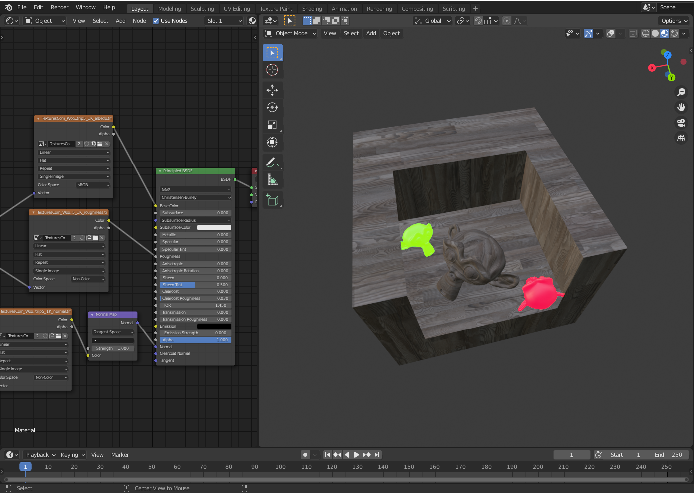
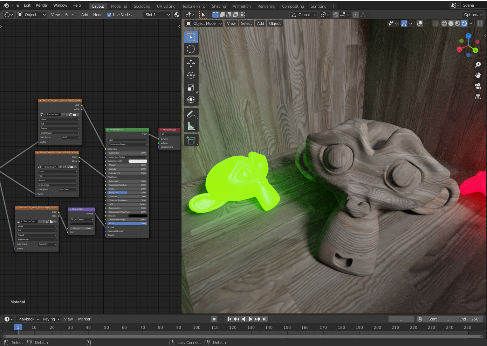
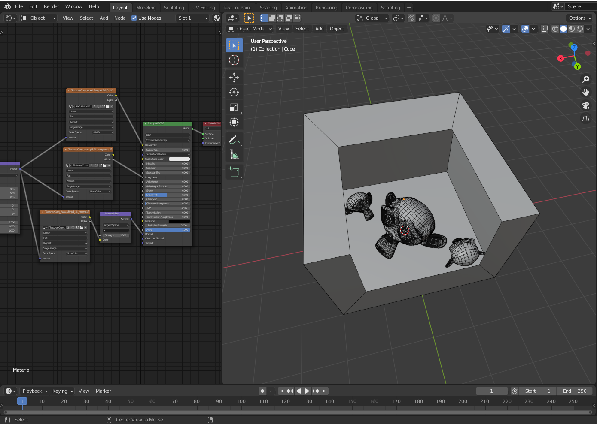
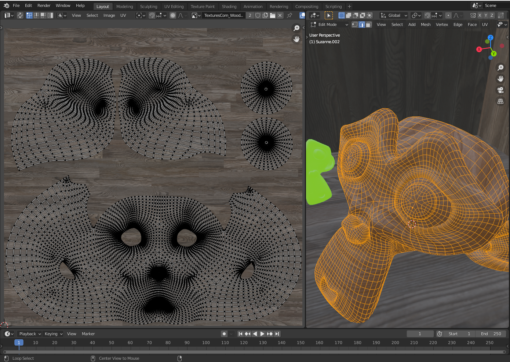
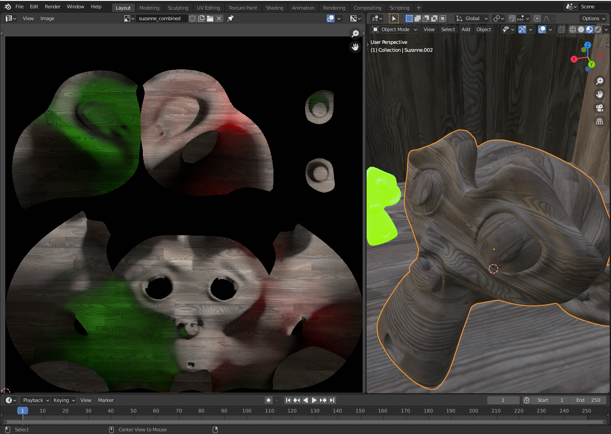
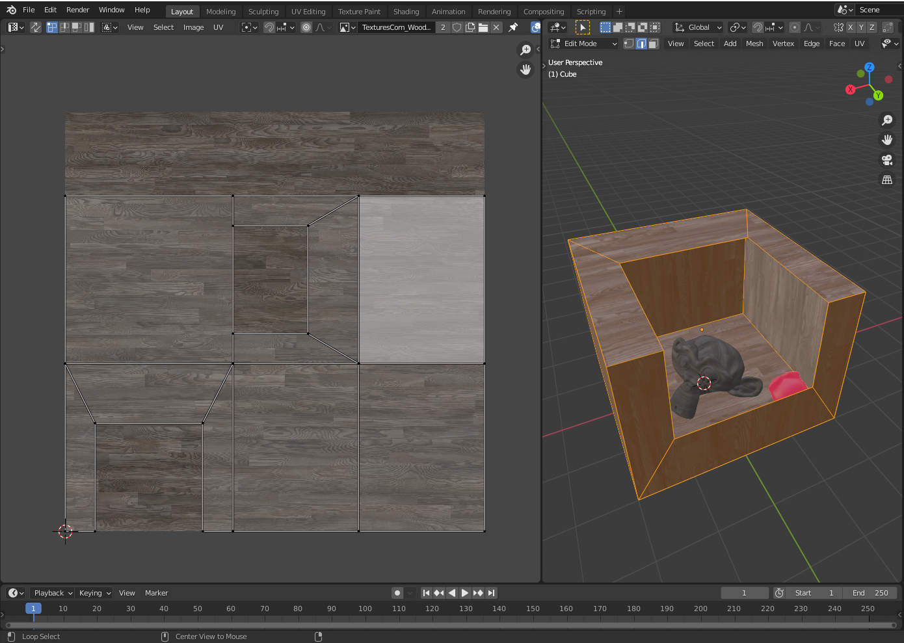
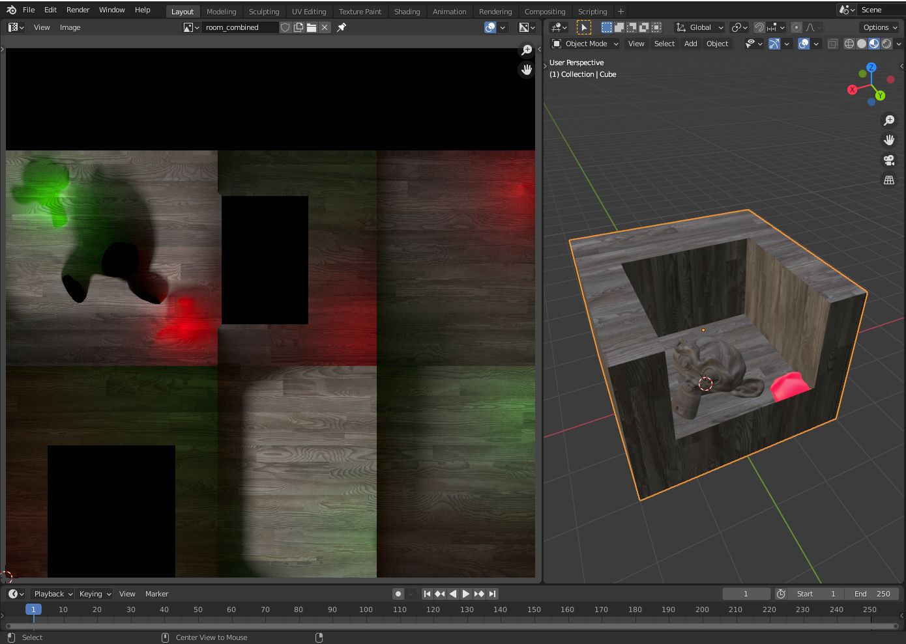
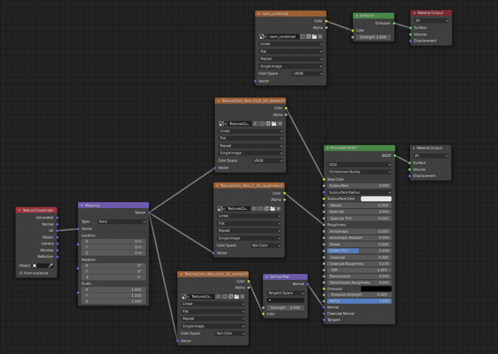

# Baking Textures In PolyVR

Baking light information into a texture is useful if you want to represent light information that is not provided by the engine at runtime. A more detailled overview on how to create a baked PolyVR scene can be found in this [guide](GUIDE.md).

In the following images you can see the comparison of the tutorial scene with and without consideration of the light information. This information is to be provided in the texture and made available in PolyVR.

(All images can bee viewed in original size by right clicking them and opening them in a new tab)

## Scene

The first step of this tutorial is a scene. It is important that each object has its own UV map. For a better representation of the light conditions i chose a room with an open wall and ceiling and placed three Suzannes in it.

## Materials and Textures

I assigned a seamless wood texture to the objects in the scene. Two Suzannes emit red and green light to have more representative light information. Weather the textures are generic, tiled or mapped is irrelevant to the baking process, but the final result will be a mapped texture. Accordingly, a larger texture can be used to achieve more precise results.
It is also important that every object that is supposed to have mapped light information has its own UV map and no overlapping areas. An unwrapped object with a mirror modifier for example will also mirror the light information.
One exception to this rule would be the emitting suzannes. A shadow cannot be cast to an object with emission shaders which makes them irrelevant for direct light baking.

## Preparations

To start the baking process in blender, you need to select an image file. The baking information or final texture will be saved in this file. For baking the room texture the object needs to be selected. In the shaders editor you need to create a simple [Image Texture Node](https://docs.blender.org/manual/en/2.79/render/cycles/nodes/types/textures/image.html) without plugging it into any shader node. The image texture node can be used to create an image file with properties like aplha channel and size. Alternatively, the image file can be created in the image editor panel and then be selected in the image texture node.

Additionally, the render engine of this blender scene needs to be set to cycles for the baking process. If this is the case there will be a new category "baking" in the "render properties" panel. In the baking category there can be switched between different modes. Suitable for our purposes is the combined mode.

## Baking Of Combined Textures

To bake the information to an object there needs to be an image file selected. For this purpose, as previously mentioned, you create and select an image texture node in the shader editor. Blender will bake the information for every material into the selected image of this material. Assuming we had a chair with a wooden material for the legs and a fabric material for the cushion we would have to create an image texture node with an image file for both materials. The image file itself can be the same for every material as long as the UVs of cushion and legs are not overlapping each other.

If the image file is selected for all materials to be baked (in our case just the wood of the walls), the baking process can be started. In the combined mode of the baking panel there can be made [adjustments](https://docs.blender.org/manual/en/2.79/render/cycles/baking.html?highlight=bake%20combined#bake-mode) to fit our needs. As we have no translucent materials in our scene we can untick this option for example without losing any information in our final result.  

The baking can be started by pressing "Bake" will take several minutes up to hours, depending on the complexity of the scene. Time for a coffee :)

## Material Setup

If the final textures have been baked, it is important to [save them manually](https://www.sketchoverflow.com/2020/12/save-image-blender-2-9/). Depending on the preferences and settings, the images disappear when you close or restart Blender. If you want to see your final result in blender you can simply create a second material path with a new material output node. For this second path you can choose an [Emission Shader](https://docs.blender.org/manual/en/2.79/render/cycles/nodes/types/shaders/emission.html?highlight=emission%20shader) and plug the texture in the color slot. Combined textures are designed to be used as emission textures. As all shadows are already baked into the texture there is no need to have any shadows cast on the object.

By clicking on the different [Output Nodes](https://docs.blender.org/manual/en/2.79/render/cycles/nodes/types/output/material.html?highlight=material%20output%20node) you can switch between the shader paths.

## Export

Exporting the object as Collada files for PolyVR does not work for emission shaders yet. It is therefore necessary to create another material in which the new image texture is connected to a Principled BSDF colour slot before exporting the object.

