# Guide zur Erstellung von optimierten Assets und Szenen für Spiele und VR

## Übersicht

- [Allgemein](#allgemein)
    - [Runtime Beleuchtung](#beleuchtung-runtime)
    - [Beleuchtung in Texturen integriert](#beleuchtung-integriert)
- [Modelling](#modelling)
    - [Heightmaps als Mesh](#heightmaps)
    - [Stoff](#fabric)
- [LODs](#lods)
- [UV-Mapping](#uvmapping)
- [Baking](#baking)
    - [Prozedurale Texturen](#bake_procedural)
    - [Prozedurale Normalmaps](#bake_procedural_normals)
    - [Normalmaps aus Meshes](#bake_normal_from_mesh)
    - [UV Maps](#bake_uv_maps)
    - [Diffuse Informationen](#bake_diffuse)
    - [Combined Informationen](#bake_combined)

## Allgemein

Beim Erstellen und Optimieren von 3D-Assets für Runtimeanwendungen wie Spiele, Simulationen oder allgemein Virtual Reality ist es wichtig, einen Blick auf die Performance zu werfen.
Im Gegensatz zum allgemeinen Erstellen von Assets und beispielsweise Verwenden von 3D-Scans kann viel Performance durch gute Meshes, UV-Mapping und Baking gewonnen werden.

In diesem Dokument möchte ich verschiedene Ansätze aufzeigen, die ich für das Projekt "3D-Lobby in PolyVR" angewandt habe und die für mich gut funktioniert haben.
Gerne dürfen auf Fehler in dem Dokument hingewiesen und neue Ansätze ergänzt werden.
Ich beziehe mich auf die für das Projekt hauptsächlich verwendeten Programme PolyVR und Blender.

Es gibt für das Erstellen von Szenen und Assets für Runtimeanwendung mehrere Ansätze, die sich je nach Engine mehr oder weniger anbieten. So kann man beispielsweise die Assets wie ein Sofa ohne Zusammenhang mit der
finalen Szene erstellen und in der Engine dann richtig positionieren. Das Sofa, als Beispiel, enthält dann Informationen wie die UV-Map und die Texturen, jedoch noch keine Lichtinformationen.
Engines wie Unity bieten hier die Möglichkeit, die Lichtinformation nach dem Zusammensetzen der Szene zu baken und zu speichern, wodurch beim Starten und Laufen der Anwendung weniger Rechenleistung aufgebracht werden muss.
Bietet die verwendete Engine kein Baking an, kann dieser Schritt manuell in Blender getätigt werden.
Ich möchte also unterscheiden zwischen folgenden Arbeitsweisen:

### Runtime Beleuchtung

Bei der Runtime Beleuchtung und der im Vorhinein berechneten Lichtinformation durch Baking enthält das Modell keine Lichtinformationen, sondern lediglich Mesh, UV-Map und Material.

<b>Vorteile:</b>
- Schnelleres Arbeiten, weil Assets unabhängig voneinander erstellt werden können
- Objekte können in der Engine beliebig positioniert werden.
- Objekte können runtime bewegt und animiert werden.

<b>Nachteile:</b>
- Sofern die Schatten nicht prebaked wurden ergibt sich ein erhöhter Rechenaufwand
- Wenn die Schatten prebaked sind, gibt es bei einzelnen Objekten mehr Information zu speichern. Licht und Farbe liegen in verschiedenen Dateien.

### Beleuchtung in Texturen integriert

Durch das Baking in Blender lassen sich Lichtinformationen fotorealistisch in die Texturen baken. Über die Rendereinstellung lässt sich definieren, wie realistisch die Lichtberechnungen ablaufen sollen.
Die fertige Textur enthält je nach Vorgabe unter anderem Schatten, Emission, Umgebungsreflektionen und Transmission, was einmal in Blender, dann jedoch nicht mehr in der Engine berechnet werden muss.

<b>Vorteile:</b>
- Je nach Rahmenbedingungen können sehr realistische Ergebnisse erzielt werden. Da beispielsweise Reflektionen vom Winkel des Betrachtens abhängen, ist die Szene in dieser Hinsicht auf die Engine limitiert.
- Performance-optimiert, was zum Beispiel bei VR eine große Rolle spielt um Effekte wie Motion Sickness zu vermeiden.

<b>Nachteile:</b>
- Die Szene wird sehr statisch. Sich bewegende Objekte können nicht vorberechnet werden, da durch die Bewegung andere Lichtverhältnisse entstehen.
- Optimierungen in der Raumkomposition können nur mit neuem Baking getan werden. Verschiebt man beispielsweise das Sofa, bleibt der Schatten des Sofas an seiner Stelle.
- Baking ist je nach Leistung des Computers sehr zeitaufwändig und gelegentlich instabil.

## Modelling

Beim Modelling gilt in erster Linie, die Meshes klein zu halten und wenige Faces zu verwenden.
Man muss also einen Kompromiss zwischen Detailgrad und Performance eingehen. Glücklicherweise gibt es Normalmaps, um detaillierte Meshes enorm zu reduzieren, ohne viele Details zu verlieren.

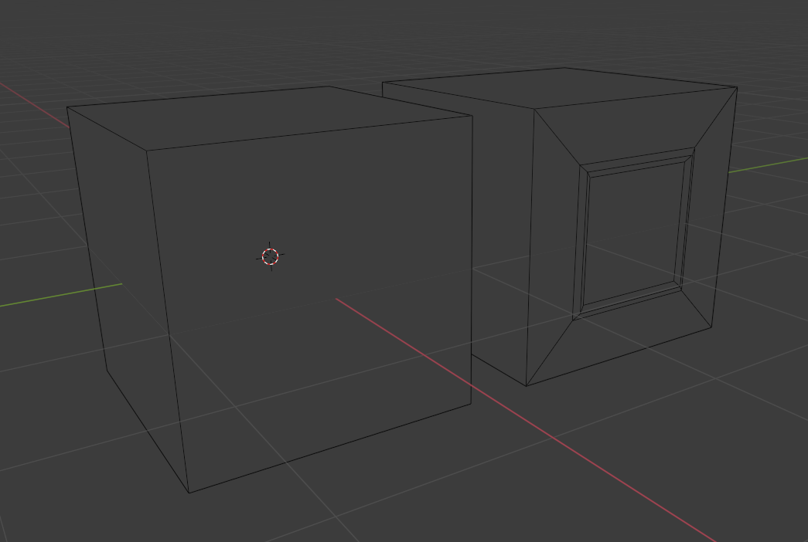
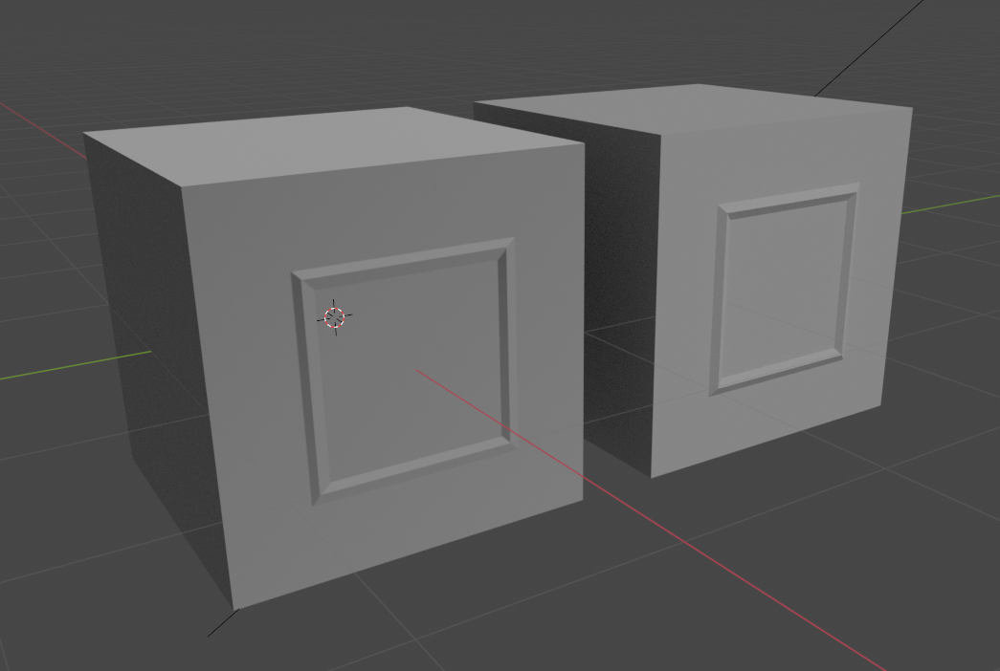

Optimieren lassen sich Meshes vorallem, wenn man dem Vorsatz des Quadmodellings folgt und N-Gons vermeidet. Ein guter erster Schritt ist beispielsweise das Reduzieren von Schleifen, die zum Beispiel durch einen Multiresolution-Modifier entstanden, jedoch nicht formgebend sind.
Enthält das Mesh N-Gons oder Tris, die von den Quadbahnen ablenken, verlaufen Edgeloops meist über das ganze Mesh und es ist nicht möglich, sie zu entfernen ohne der Form des Objekts zu schaden.

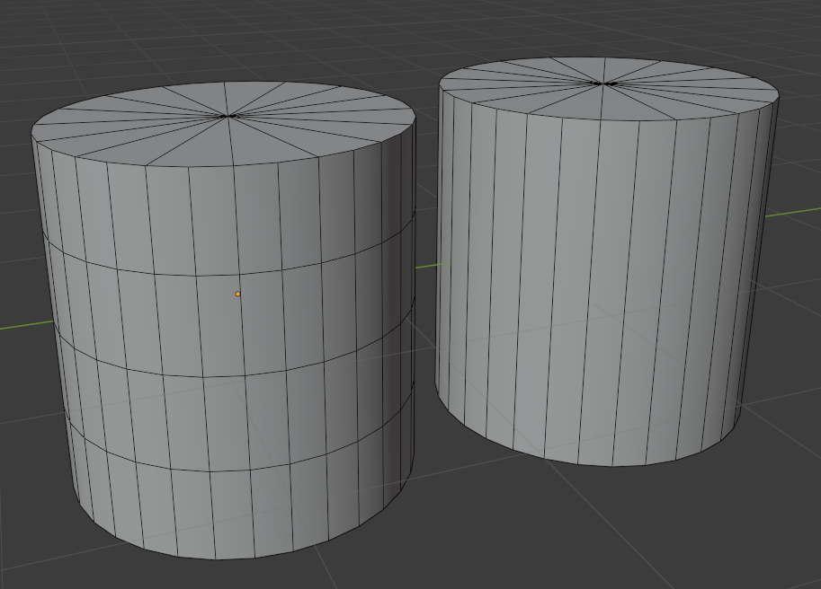
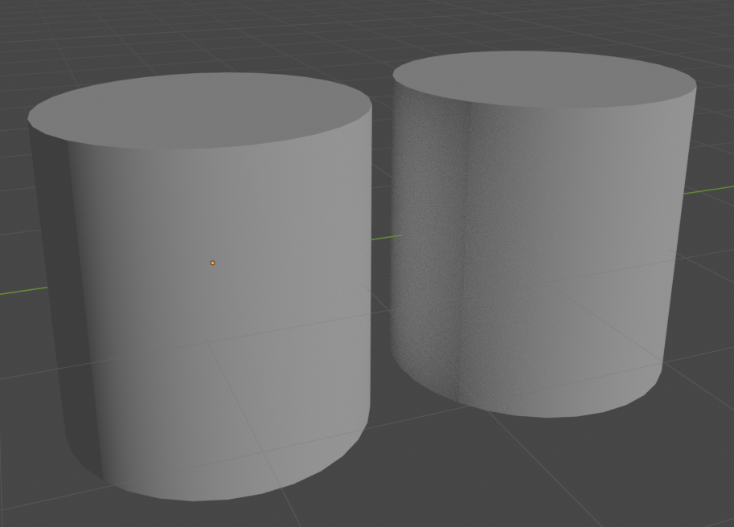

Mithilfe von Insets lassen sich viele Schleifen vermeiden, ohne Einbuße in der Form des Meshes zu haben.

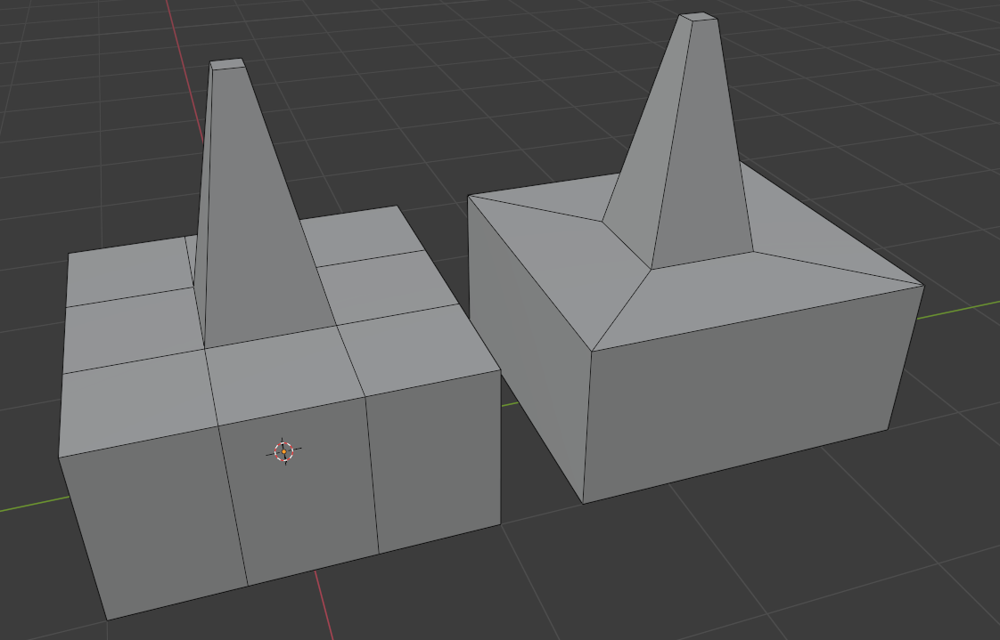

Zuletzt gibt es den Ansatz, Meshes voneinander zu lösen, wenn man auf diese Weise maßgeblich Scheitelpunkte einsparen kann.
Beispielsweise kann man die Beine eines Tisches als seperate Meshes im gleichen Objekt modellieren. Die Texturfläche, die auf der Tischunterseite durch die Beine verdeckt wird, würde vermutlich keine andere Verwendung finden und der Gewinn ist, dass die ohnehin flache Ebene keine unnötigen Unterteilungen hat.

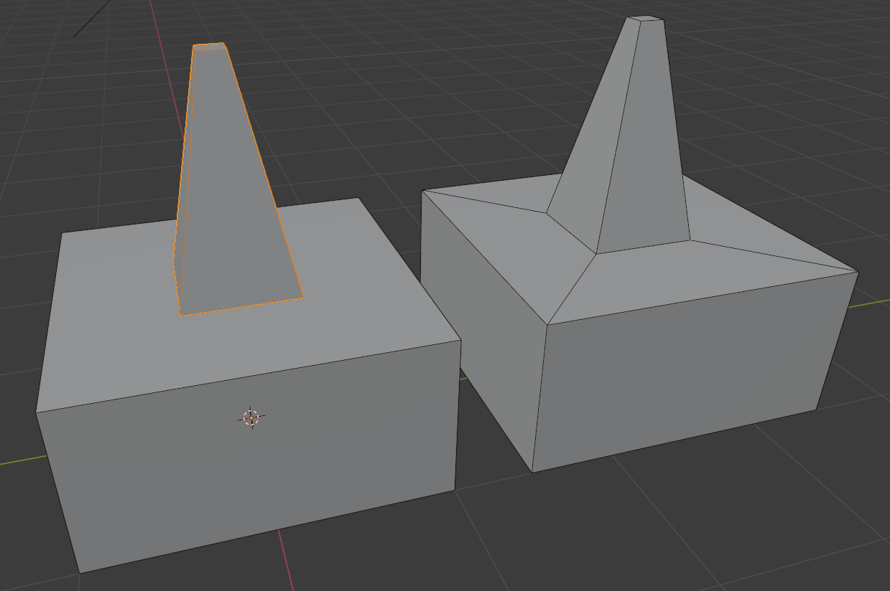

Ist das Mesh in den finalen Zügen, kann man die Quadstruktur brechen und Scheitelpunkte vereinen, um unnötige Faces zu vermeiden.

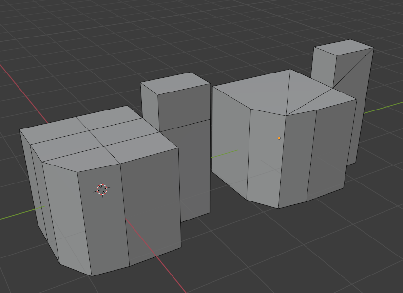

Die Herangehensweisen beim Modellieren eines Objektes sind natürlich fallabhängig und nicht immer ist es der richtige Weg,
ausschließlich die Face Zahl zu reduzieren. Wendet man zum Beispiel einen Subdivision Modifier an, ist dieser möglicherweise
bis zuletzt zur Erstellung der LODs wichtig und benötigt eine gleichmäßige Quadstruktur. 

### Height Maps als Mesh

Für die Erstellung von detaillierten Meshes wie einer Sandsteinmauer bieten sich Heightmaps an. Heightmaps lassen sich in Blender als Modifier
auf ein Mesh anwenden. Ist das Mesh hochaufgelöst genug, kommen die Details zur Geltung. Um eine gleichmäßige Unterteilung zu erzielen, sollte
das Mesh in seiner Grundform eine Quadstruktur mit einigermaßen quadratischen Quads besitzen.

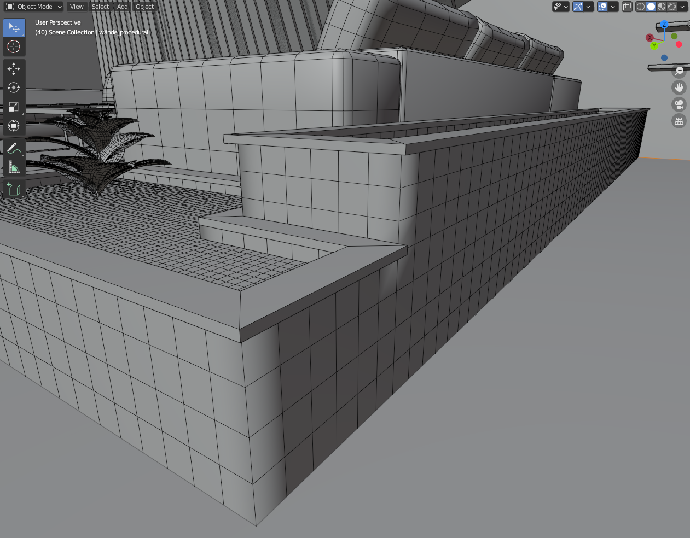
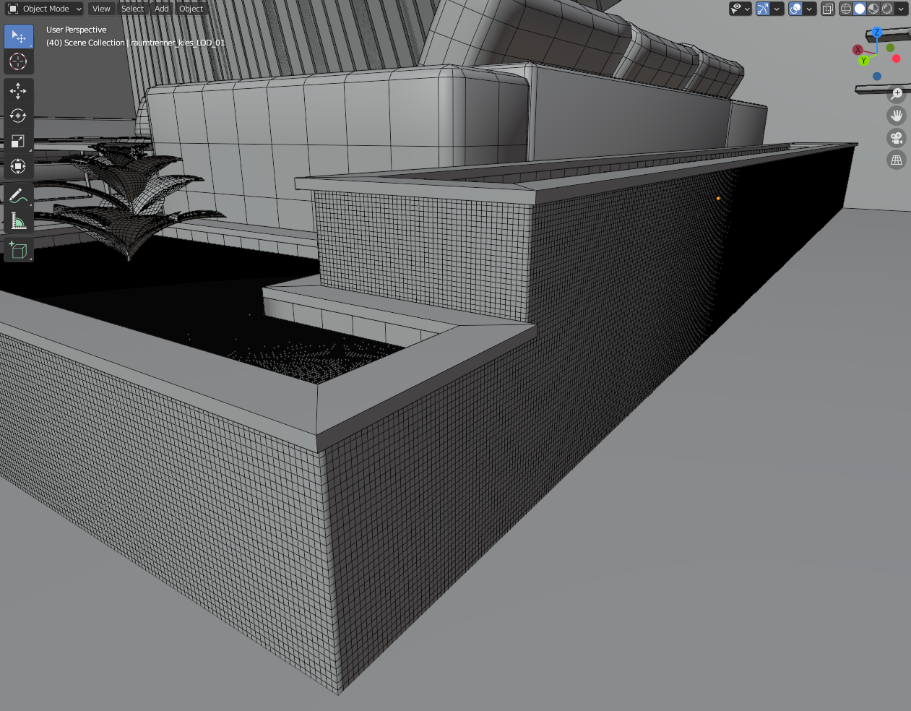
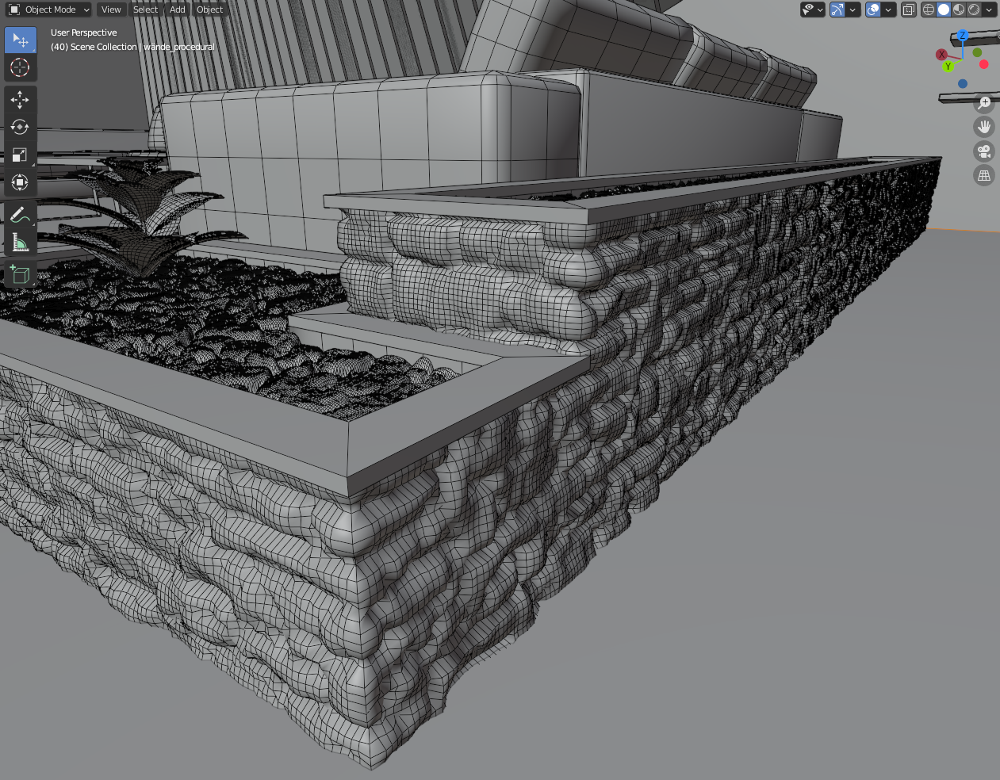

Mithilfe des Subdivision-Modifiers lässt sich das Mesh schrittweise feiner aufbauen. Hat man einen gewünschten Detailgrad erreicht, kann man
sowohl den Subdivision- als auch den Displacementmodifier anwenden. Die [LODs](#lods) des Objektes lassen sich erstellen, indem man mit dem Decimatemodifier
schrittweise Unterteilungen entfernt. Der Decimatemodifier bietet hierbei doppeltsoviele Schritte an wie der Subdivisionmodifier, weshalb sich diese Reihenfolge für mich bewehrt hat.

### Stoff

Bei dem Modellieren von Stoff wie Tischdecken, Vorhängen und Kleidern gilt wie immer, die Zahl der Polygone gering zu halten. Für eine realistische Simulation benötigt Blender eine angebrachte Unterteilung des Meshes. Nachdem der Stoff die gewünschte Form angenommen hat, lässt er sich zu einem statischen Objekt konvertieren, in dem man den Cloth Modifier im Modifier Reiter anwendet. Das nun entstandene Mesh kann aufgrund der gleichmäßigen Quadstruktur leicht vereinfacht werden. Es bietet sich an, insbesondere entlang der Falten schleifen zu entfernen, wodurch die Quads beispielsweise insgesamt eine längliche QUaderform bekommen.

Ist der Stoff zum Beispiel mit einem transluzenten oder transparenten Shader ausgestattet, lässt sich dieser als [combined texture baken](#bake_combined) und als Emissionsslot auf das Objekt anwenden. Die realistischen Lichtbrechungen und Reflektionen sind damit in der Textur gespeichert. 

## LODs

LOD steht für Level of Detail und bezeichnet verschiedene Versionen mit unterschiedlichem Detailgrad eines bestimmten Objektes. ([Wikipedia](https://de.wikipedia.org/wiki/Level_of_Detail)).
LODs werden vorallem in Anwendungen mit Echtzeitrendering verwendet, wobei detailreiche Objekte ab einer bestimmten Entfernung zum Betrachter durch weniger rechenaufwändige Versionen ersetzt werden.

Zum Erstellen eines LODs können beispielsweise Elemente eines Objektes in die Textur und Normalmaps eingearbeitet und die Auflösung eines Surface Modifiers umgekehrt werden.

| <b>Stufe</b> | <b>LOD 7</b> | <b>LOD 5</b> | <b>LOD 3</b> | <b>LOD 1</b> |
| --- | --- | --- | --- | --- |
| <b>Verticies</b> |76672 | 19168 | 4792 | 1198 |
| <b>Bild</b> | 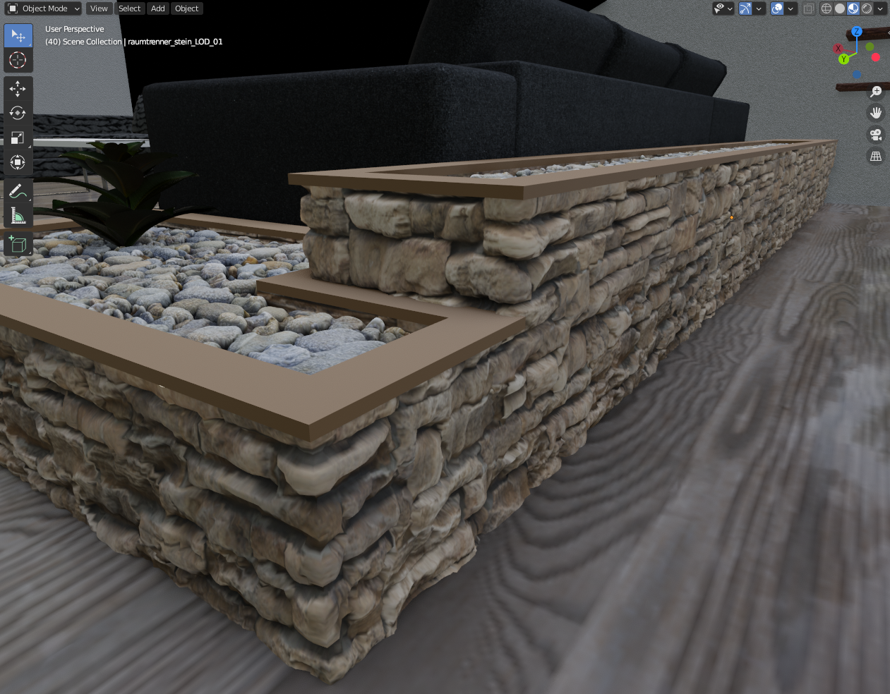 | 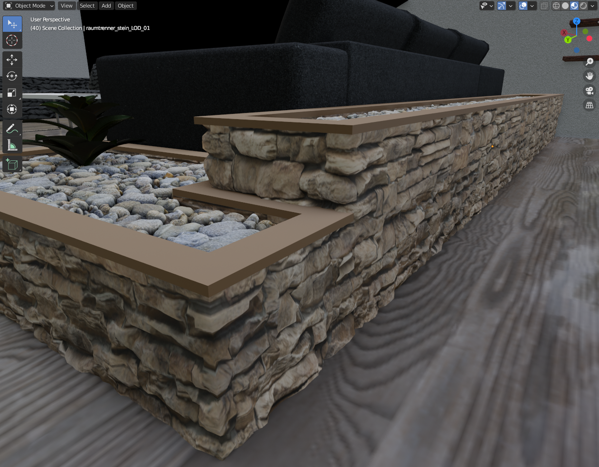 | 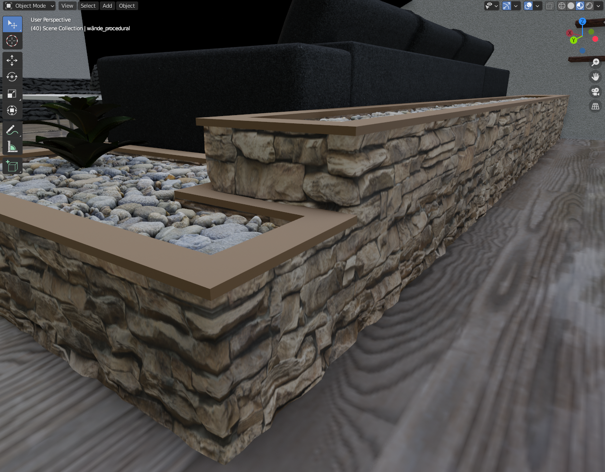 | 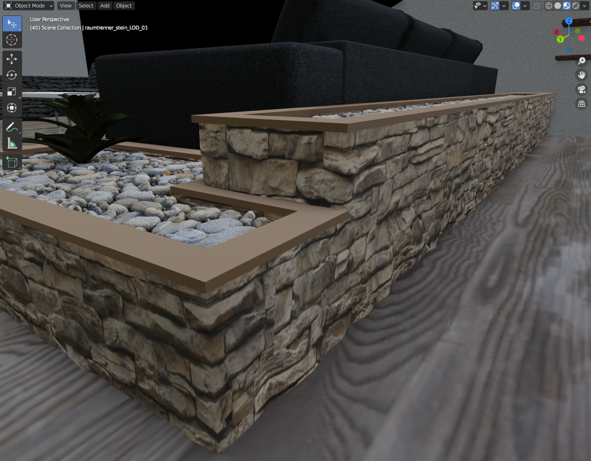 |

## UV-Mapping

UV-Mapping ist ein wichtiger Schritt für gutes Texturing. Zu beachten ist, dass die UV-Inseln flächendeckend und proportional auf der Textur verteilt sind. Außerdem gilt es, große Flächen unverwendeter Texturen zu vermeiden. Um die Performance zusätzlich zu unterstützen und die Zahl der Draw Calls zu reduzieren, sollten wenige große Texturen vielen kleinen Texturen stets bevorzugt werden. Mehr zu Draw Calls und Vertex Rendering [hier](https://www.khronos.org/opengl/wiki/Vertex_Rendering).
Das bedeutet, dass zum Beispiel nicht jedes Buch in einem Regal auf eine eigene Textur gemappt sein sollte, sondern zum Beispiel das ganze Regal sich eine Textur teilt. Sofern von der Engine unterstützt, können auch Normalmaps und Roughnessmaps auf die Texturen gemappt sein, um in einem Set aus Texturen verschiedene Materialien darstellen zu können.

Im Bezug zu den oben genannten Schattenberechnungen gibt es noch zu beachten:
Berechnet man den Schatten und andere Lichteinwirkungen in Blender als Baking und speichtert diese in eine Textur, braucht das Objekt selbst ein gleichmäßiges und nicht überlappendes UV-Mapping. Das gilt auch, wenn das Objekt selbst beispielsweise ein einfarbiges lowpoly Objekt ist und keine Texturen hat, schließlich muss die berechnete Information in der Textur dem Objekt irgendwie zugeordnet werden können.
Zudem braucht beispielsweise jeder Stuhl an einem Tisch eine eigene Textur, wenn dieser Lichtinformationen enthalten soll, da die Beleuchtung von der Position des Stuhles abhängt.

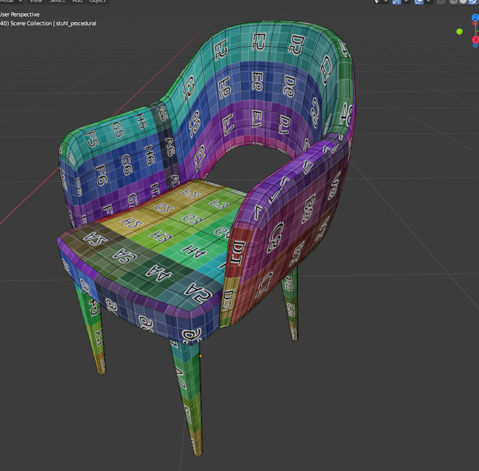
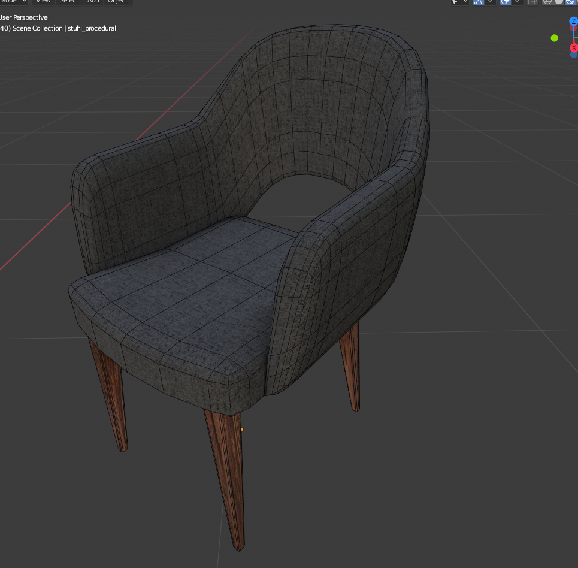
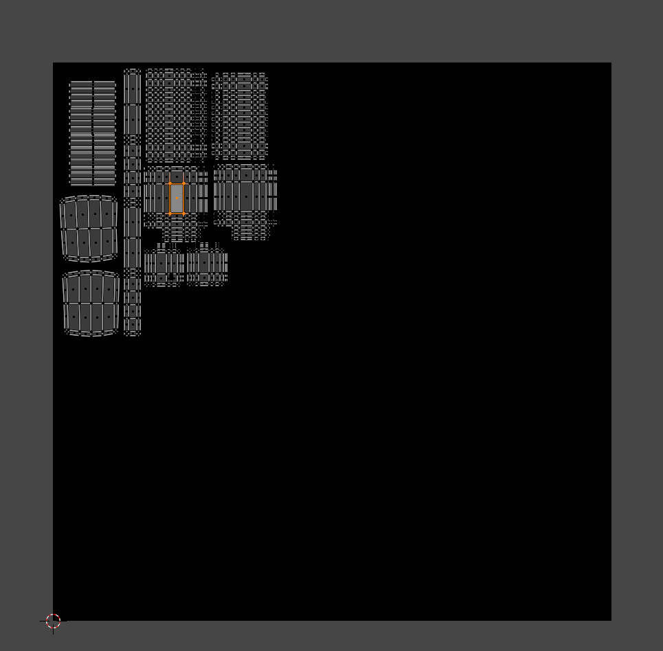

## Baking

Das Baking ist ein Prozess in Blender, der vielfältige Anwendung findet. Die Funktion ist nach dem aktuellen Stand (05.2021) nur in der Renderengine Cycles enthalten. Baking kann verwendet werden, um Texturen und Materialien aller Art zu konvertieren. Hier möchte ich aufführen, welche Varianten des Bakings für mich bei der Erstellung von der VR Lobby und den Assets hilfreichn waren und wie man diese verwendet.  

### Prozedurale Texturen

### Prozedurale Normalmaps

### Normalmaps aus Meshes

### UV Maps

### Diffuse Informationen

### Combined Informationen
